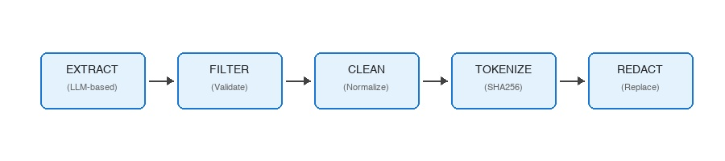

# Building a Tokenization-Based PII De-identification System in Snowflake

*Why removing sensitive data isn't always the answer—and how to build referential tokenization using Snowflake Cortex*

After years of building data protection solutions at Google—including work on Cloud DLP's de-identification capabilities—I've learned that **how** you protect sensitive data matters as much as **whether** you protect it.

At Google, I helped build solutions for [de-identifying BigQuery data at query time](https://github.com/GoogleCloudPlatform/bigquery-dlp-remote-function) using Sensitive Data Protection (formerly Cloud DLP).
That system uses BigQuery remote functions backed by Cloud Run to call the DLP API,
enabling SQL-based encryption and decryption of PII.
The key insight: de-identification techniques like encryption **preserve the utility of your data for joining or analytics**,
while reducing the risk of handling it. This reversible tokenization enables powerful workflows—you can analyze de-identified data, then re-identify specific records when business needs require it.

Snowflake's [AI_REDACT](https://docs.snowflake.com/en/sql-reference/functions/ai_redact) function takes a different approach:
It **removes** PII entirely, replacing values with category placeholders:

```sql
SELECT AI_REDACT(
    input => 'Contact John Smith at john@email.com',
    categories => ['NAME', 'EMAIL']
);
-- Returns: "Contact [NAME] at [EMAIL]"
```

For many pure compliance use cases, this is acceptable; What happens when you need to:

- **Deduplicate customer issues** across multiple support tickets?  
- **Track entity frequency** without exposing the actual values?  
- **Join de-identified datasets** on the same individual?  
- **Maintain referential integrity** across related records?

With removal-based redaction, "John Smith" in Ticket A and "John Smith" in Ticket B become indistinguishable `[NAME]` placeholders. The analytical value is lost.

## The Solution: Deterministic Tokenization

The answer is **tokenization**—replacing sensitive values with deterministic, irreversible tokens that preserve referential relationships without exposing the underlying data.

```sql
SELECT AI_DEIDENTIFY_TEXT('Contact John Smith at john@email.com');
-- Returns: {
--   "deidentified_text": "Contact __ENTITY_PERSON_NAME(a1b2c3...)__ at __ENTITY_EMAIL_ADDRESS(d4e5f6...)__",
--   "extracted_entities": [...]
-- }
```

The same input always produces the same token. "john@email.com" across 100 tickets becomes the same hash, enabling deduplication, frequency analysis, and cross-record joins while maintaining privacy.

I am demonstrating the solution using SHA256 hashing, though you can always plug-in your choice of tokenisation by modifying the `TOKENIZE_SENSITIVE_VALUE` function.

## Architecture Overview

The solution follows a five-stage pipeline, implemented entirely within Snowflake using Cortex LLM functions:



Each stage is implemented as a modular SQL UDF, composable and independently testable.

## Stage 1: LLM-Powered Entity Extraction

Traditional regex-based extraction struggles with the variability of unstructured text. 
Names can be "John Smith", "Dr. J. Smith", or "Smith, John". Phone numbers appear as "0412345678", "0412 345 678", or "+61 412-345-678".

For Snowflake, we leverage Cortex LLM capabilities to achieve similar detection flexibility.

**Why Claude Sonnet 4.5?**

Entity extraction for PII is a high-stakes task where false negatives (missed PII) create compliance risk and false positives degrade data utility. I chose Claude Sonnet 4.5 for several reasons:

- **Instruction Following**: Larger models excel at following complex extraction rules—distinguishing between "Apple" (company) and "Apple" (fruit), or recognizing that "Dr. Smith" and "John Smith, MD" refer to the same entity type
- **Structured Output Reliability**: Sonnet 4.5 consistently produces valid JSON when using the `response_format` parameter, whereas smaller models occasionally break schema compliance
- **Context Awareness**: The model understands contextual cues—"Call me at 1234" is likely not a phone number, but "Call me at 0412 345 678" is
- **Few-Shot Learning**: Larger models generalize better from examples, reducing the prompt engineering required for edge cases

For production workloads where cost is a primary concern, consider testing with smaller models like `llama3.1-70b` or `mistral-large2`.
The trade-off is typically more false positives/negatives and occasional JSON parsing failures that require retry logic.

Using Snowflake Cortex's [`TRY_COMPLETE`](https://docs.snowflake.com/en/sql-reference/functions/try_complete-snowflake-cortex) function with structured JSON output:

```sql
CREATE FUNCTION LLM_EXTRACT_ENTITIES(raw_text TEXT)
RETURNS OBJECT AS $$
SNOWFLAKE.CORTEX.TRY_COMPLETE(
    'claude-sonnet-4-5',
    [ /* system prompt with validation rules */, 
      {'role': 'user', 'content': CONCAT('RAW_TEXT:\n', raw_text)} ],
    { 'response_format': { 'type': 'json', 'schema': { /* entity schema */ } } }
)
$$;
```

**Key Principles:**
* Structured Output: Early iterations returned markdown-formatted JSON, causing parsing failures. The fix: enforce structured output using the `response_format` parameter with a JSON schema—guaranteeing machine-parseable responses every time.
* Few-Shot Learning: Including examples in the prompt dramatically improves extraction accuracy, teaching the model what to extract and what to ignore.
* Validation Rules: The prompt includes explicit validation rules to reduce false positives—phone number formats, credit card prefixes, email structure, and region-specific patterns like Australian driver's license formats by state.

## Stage 2: Value Normalization

The same entity can appear in many formats -  `0412 345 678`, `0412-345-678` or `+61 412345678`. 
Without normalization, each format produces a different token—breaking referential matching.

This function ensures that information values are in a single canonical form, ensuring consistent tokenization.

```sql
CREATE FUNCTION CLEAN_SENSITIVE_VALUE(i_type STRING, i_text STRING)
RETURNS STRING AS $$
CASE i_type
  WHEN 'PHONE_NUMBER' THEN 
    REGEXP_REPLACE(REGEXP_REPLACE(i_text, '^\+61', '0'), '[^0-9]', '')
  WHEN 'EMAIL_ADDRESS' THEN LOWER(TRIM(i_text))
  WHEN 'PERSON_NAME' THEN UPPER(TRIM(REGEXP_REPLACE(i_text, '\s+', ' ')))
  -- additional types...
END
$$;
```

## Stage 3: Deterministic Tokenization

The tokenization function is intentially separated as a user-defined function,
this allows one to swap and plug-in their choice of tokenization logic.

```sql
CREATE FUNCTION TOKENIZE_SENSITIVE_VALUE(sensitive_value STRING)
RETURNS STRING AS $$
  SHA2(sensitive_value, 256)
$$;
```

I have used SHA256 for demo purposes:
**Why SHA256?**
- **Deterministic**: Same input always produces same output
- **Irreversible**: Cannot recover original value from hash
- **Collision-resistant**: Different inputs produce different outputs
- **Pluggable**: Easily swap for HMAC or format-preserving encryption if needed

## Stage 4: Orchestration

The `AI_DEIDENTIFY_TEXT` function orchestrates the pipeline using Snowflake's array functions—TRANSFORM, FILTER, and REDUCE—to process entities through each stage efficiently.

The function returns both the redacted text and full entity metadata, enabling auditing and analysis of what was detected.
## Batch Processing for Scale

LLM calls have latency. Processing 10,000 records with individual calls is impractical.

```sql
SELECT AI_DEIDENTIFY_TEXT_BATCH(
    ARRAY_CONSTRUCT(
        'Contact John at john@email.com',
        'Call Sarah at 0412-345-678',
        'Email support@company.com'
    )
);
```

One LLM call extracts entities from all texts, with results mapped back by record index. For large tables, batch sizes of 10-15 records balance latency reduction against prompt size limits.

## Output Format

The function returns both the redacted text and full entity metadata:

```json
{
  "deidentified_text": "Contact __ENTITY_PERSON_NAME(a1b2c3...)__ at __ENTITY_EMAIL_ADDRESS(d4e5f6...)__",
  "extracted_entities": [
    {
      "type": "PERSON_NAME",
      "value": "John Smith",
      "cleaned_value": "JOHN SMITH", 
      "token": "a1b2c3d4e5f6..."
    },
    {
      "type": "EMAIL_ADDRESS",
      "value": "john@email.com",
      "cleaned_value": "john@email.com",
      "token": "d4e5f6a1b2c3..."
    }
  ]
}
```

The `extracted_entities` array enables:

- Auditing what was detected and redacted  
- Building token-to-entity mapping tables (for authorized re-identification)  
- Analyzing entity frequency and distribution

## Cost Considerations

Cortex LLM functions are billed per token processed. Understanding the cost structure helps you budget and optimize:

**Token Economics**
- Input tokens: Your text + system prompt + few-shot examples
- Input tokens are typically cheaper than output tokens; Using few shot learning can dramitically improve accurancy without significant additional cost. 
- Output tokens: The extracted entities JSON

**Cost Optimization Strategies**

- **Batch processing** (5-10x cost reduction): Send multiple texts in a single LLM call. Trade-off: slightly higher latency per batch.
- **Smaller models** (3-5x cost reduction): Use `llama3.1-70b` or `mistral-large2` instead of Claude. Trade-off: more false positives/negatives and occasional JSON parsing failures.
- **Pre-filtering** (variable impact): Skip records unlikely to contain PII. Trade-off: may miss PII in filtered records.
- **Caching results** (eliminates re-processing): Store token mappings for previously processed text. Trade-off: storage costs for the mapping table.

**Estimated Costs** (approximate, check [Snowflake pricing](https://www.snowflake.com/legal/pricing-guide/) for current rates):
- Single text (100 words): ~500 input tokens + ~300 output tokens
- Batch of 10 texts: ~2,500 input tokens + ~1,500 output tokens (vs. 5,000 + 3,000 individually)

**Recommendation**: For initial development and testing, use the single-text function. For production pipelines processing >1,000 records, always use batch processing. Consider implementing a token mapping cache to avoid re-processing identical text values.

## Use Cases Enabled

### 1. Customer Issue Deduplication

```sql
SELECT token, COUNT(*) as mentions, ARRAY_AGG(DISTINCT ticket_id) as tickets
FROM deidentified_tickets, LATERAL FLATTEN(result:extracted_entities)
WHERE value:type = 'PERSON_NAME'
GROUP BY token HAVING COUNT(*) > 1;
```

Find customers mentioned across multiple tickets—without exposing their names.

### 2. Cross-Dataset Entity Matching

Join tickets to orders on tokenized customer identity—enabling analytics across datasets without exposing PII.

```sql
SELECT 
    a.ticket_id,
    b.order_id
FROM deidentified_tickets a
JOIN deidentified_orders b
ON a.customer_token = b.customer_token;
```

### 3. Frequency Analysis

Understand PII distribution and prevalence without accessing actual values.

```sql
SELECT 
    value:type::STRING as entity_type,
    COUNT(*) as occurrences
FROM deidentified_data,
LATERAL FLATTEN(result:extracted_entities)
GROUP BY entity_type;
```

## Conclusion

Removal-based redaction has its place, but tokenization unlocks analytical capabilities that pure removal cannot.
This solution combines:

- **LLM-powered extraction** to handle the variability of unstructured text
- **Validation rules** to reduce false positives
- **Normalization** to ensure consistent cross-format matching
- **Deterministic hashing** for irreversible but referential tokenization

The result is a system that protects privacy while preserving analytical value.

The modular design means you can swap tokenization strategies, add entity types, or adjust validation rules without rewriting the pipeline.

The full implementation is available on GitHub at [sfguide-customer-issue-deduplication-demo](https://github.com/Snowflake-Labs/sfguide-customer-issue-deduplication-demo), including the core single-text functions, [batch processing](ai_deidentify_batch.sql) variants, and an interactive [demo notebook](AI_DEIDENTIFY_DEMO.ipynb) with test cases. Clone the repo, deploy the SQL files to your Snowflake environment, and start building privacy-preserving analytics pipelines today.
