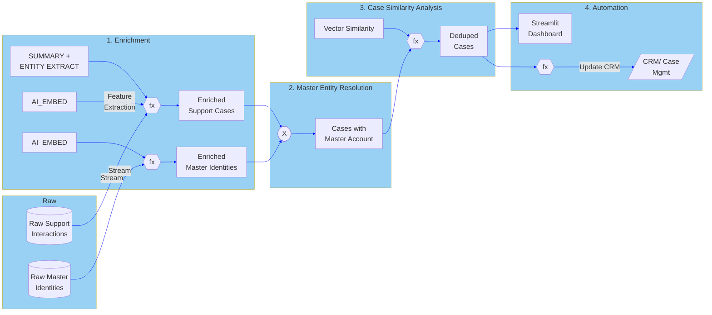

# Smart Complaint deduplication using Snowflake-native AISQL

By Anant Damle & Nathan Birch

Story Link: [https://medium.com/snowflake/smart-complaint-deduplication-using-snowflake-native-aisql-2bab5885e277](https://medium.com/snowflake/smart-complaint-deduplication-using-snowflake-native-aisql-2bab5885e277)

Customer issue management is an inevitable part of doing business in today’s world. Duplicate complaints remain a common
challenge for organisations, often stemming from customers following up on similar issues through different channels and
lack of reliable master account information, leading to frustrating experiences for both customers and support teams,
and ultimately, skewed reporting.

Imagine a customer raising a complaint via a webform, then following up with a phone call about the same issue.
Without a robust system, the on-call person might be unaware of the previous interaction, leading to redundant efforts
and a lack of visibility into the true state of a customer's issue. The Challenge: unreliable matching, lost visibility
and wasted resources.

Traditional methods often rely on name/entity resolution, extracting attributes like name, phone number, or email using
regex or other forms of patterns and then match to related issues. However, these identifiers aren't always reliable.
Account numbers or License Plate Numbers (LPNs) can be inconsistent, and even within a short timeframe (e.g., 5 days),
the same issue might be treated as a new complaint. The result? Duplicate reports that obscure the real count of unique
issues, hindering effective analysis and decision-making.

# Architecture

A Snowflake-native solution designed to address these deduplication challenges, provides a clear and accurate picture of
customer complaints.



1. **Preprocessing/Enrichment:** Extract entities and summarise the case using Snowflake Cortex  
2. **Master Entity Resolution:** Associate cases to an account id through a combination of deterministic, fuzzy and
   vector matching techniques.  
3. **Similarity Analysis & Deduplication:** Compares cases within the same master account to generate a similarity score
   and explanation, ensuring efficient and accurate deduplication.  
4. **Orchestration & Automation:** You can automatically update CRM from Snowflake using stored procedures or a 
    Streamlit-based dashboard to visualise the results. These will need to be built and are not included in the code 
   artifacts.

# Objectives

Key Snowflake AISQL Functions Covered:

[`AI_COMPLETE`](https://docs.snowflake.com/en/sql-reference/functions/ai_complete) – Generates structured data from unstructured text using prompts, and provides content similarity
analysis with explanations.

[`AI_EMBED`](https://docs.snowflake.com/en/sql-reference/functions/ai_embed) – Converts text into vector embeddings, enabling semantic search and matching based on meaning.

[`VECTOR_COSINE_SIMILARITY`](https://docs.snowflake.com/en/sql-reference/functions/vector_cosine_similarity) – Compares vectors generated by AI\_EMBED to identify related content through semantic
similarity.

[`JAROWINKLER_SIMILARITY`](https://docs.snowflake.com/en/sql-reference/functions/jarowinkler_similarity) – Performs fuzzy string matching, useful for handling names or identifiers with typos or
slight variations.

# Costs

This solution uses Snowflake Cortex AISQL functions which incur compute costs based on the number of tokens processed.
Refer to the [details](https://docs.snowflake.com/user-guide/snowflake-cortex/aisql?lang=de%2F#cost-considerations) for each function’s cost in credits.

# Before you begin

Create a [Snowflake notebook](https://docs.snowflake.com/en/user-guide/ui-snowsight/notebooks) from the Git repository
using these [steps](https://docs.snowflake.com/en/user-guide/ui-snowsight/notebooks-snowgit#create-a-notebook-from-a-file-in-a-git-repository).

> Use the conversion script to convert the Snowflake notebook to a regular
> Jupyter notebook with snowsql cell magic, using following command:
> ```shell
> python convert_snowflake_notebook.py ISSUE_DEDUP_NOTEBOOK.ipynb ISSUE_DEDUP_NOTEBOOK_snowsql.ipynb
> ```

# Preprocessing/Enrichment

The initial step involves extracting entities from raw support transcripts and summarizing them. This optimizes costs
by reducing the number of tokens required for vectorization but also creates a valuable knowledge base for quick search
capabilities. The solution leverages Snowflake Cortex's [`AI_COMPLETE`](https://docs.snowflake.com/en/sql-reference/functions/ai_complete) function to extract specific information
(sentiment, summary, contacts) from unstructured text, even for entities that don't follow strict patterns.
This enriched data is then vectorized using [`AI_EMBED`](https://docs.snowflake.com/en/sql-reference/functions/ai_embed) for efficient matching.

`AI_COMPLETE` provides a mechanism for specifying the [LLM model](https://docs.snowflake.com/en/sql-reference/functions/ai_complete-single-string#arguments) that one wants to use and extracting structured
data.

```sql
AI_COMPLETE(
  model => $big_llm_model,
  prompt => CONCAT('Summarise this transcript, sentiment, and contacts including contact_type oneof (name, company_name, phone_number, email, vehicle_registration):',
               transcript),
  response_format => '<json_schema_of_response>'
)
```

## Master Entity Resolution

In this stage, cases that do not have preidentified master account ids are probabilistically linked to a master account
ID using identified case entities. 

The first part of this stage combines deterministic matching (exact matches for phone, email, vehicle registration)
with fuzzy matching using [`JAROWINKLER_SIMILARITY`](https://docs.snowflake.com/en/sql-reference/functions/jarowinkler_similarity), you can use any other similarity function in conjunction
with similarity function(example [SOUNDEX](https://docs.snowflake.com/en/sql-reference/functions/soundex_p123)) depending on your needs.

Finally a vector matching with [`VECTOR_COSINE_SIMILARITY`](https://docs.snowflake.com/en/sql-reference/functions/vector_cosine_similarity) for names and company names.
The goal is to accurately associate all related interactions with a single customer profile,
even with variations in data entry.

```sql
FROM flattened_cases f
JOIN enriched_master_identities m
ON 
  f.id_type = m.type
  AND
  (
    -- exact match
    (
      f.id_type IN ('phone_number', 'email', 'vehicle_registration')                    
      AND f.id = m.value
    )
    OR
    -- fuzzy name match using Jaro-winkler match
    (
      f.id_type IN ('name', 'company_name')                    
      AND JAROWINKLER_SIMILARITY(f.id, m.value) >= 85
    )
    OR
    -- vector matching the name
    (
      f.id_type IN ('name', 'company_name')
      AND VECTOR_COSINE_SIMILARITY(f.id_vector, m.value_vector) > 0.8
    )
  )
```

The second part of this stage then assigns a single master account ID to a case based on the master ID that has the
highest match ratio, cases that do not match existing master account information are separated and will be surfaced as
possible new accounts.

```sql
SELECT
  case_id,
  master_account_id
  FROM combined_matches
  GROUP BY case_id, master_account_id
  QUALIFY ROW_NUMBER() 
    OVER (PARTITION BY case_id ORDER BY AVG(similarity_score) DESC) = 1;
```

## Similarity Analysis & Deduplication

Once cases are linked to a master account, a self-join is performed within cases of the same master id using
[`AI_COMPLETE`](https://docs.snowflake.com/en/sql-reference/functions/ai_complete) to compare cases using a prompt that
generates a similarity score (between 0 and 1\) and an explanation for the relationship between two cases. This process
is optimized to limit the comparisons to cases within the same master account, ensuring efficiency and accuracy.

```sql
AI_COMPLETE(
  model => $big_llm_model,
  prompt => CONCAT(
    'Summarise why the following interactions are related and return a similarity score on a scale of 0 to 1 both ' ||
    'inclusive, where 1 means the interactions are identical.

    interaction 1 is:\n',
    transcript_summary_a,
    '\ninteraction 2 is:',
    transcript_summary_b
    ),
  response_format => '<json_schema_of_response>'
)
```

## Orchestration & Automation

The solution can be made seamless and actionable by leveraging Snowflake’s 
[Streams](https://docs.snowflake.com/en/user-guide/streams-intro) and
[Tasks](https://docs.snowflake.com/en/user-guide/tasks-intro) for automation. This allows for automatic updates to a
duplicate\_cases table and, crucially, the ability to mark these cases as linked or duplicate in a CRM/Case management
system using [Stored Procedures](https://docs.snowflake.com/en/developer-guide/stored-procedure/stored-procedures-overview)
and [API Integrations](https://docs.snowflake.com/en/sql-reference/sql/create-api-integration)

# Outcomes

The solutions delivers:

* Duplicate cases table with four key columns:

    * **Parent CaseID:** The prior case ID.  
    * **Child CaseID:** The next message related to the parent or the same issue.  
    * **Measure of Confidence:** A probability score indicating how related the cases are.  
    * **Explanation:** A clear reason why the cases are related.


   | CASE\_A | CASE\_B | MASTER\_ACCOUNT\_ID | SIMILARITY\_SCORE | SIMILARITY\_EXPLANATION |
   | :---- | :---- | :---- | ----- | :---- |
   | CASE\_1004 | CASE\_1005 | USER\_BETA | 0.95 | Both interactions are related because they involve the same insurance claim (\#C-9881) for hailstorm damage to the same vehicle (registration XYZ-789). In the first interaction, Peter Chen mentions he will email photos, and in the second interaction, an email is sent with attached photos regarding the same claim. |
   | CASE\_1002 | CASE\_1007 | USER\_ALPHA | 0.95 | Both interactions involve Samantha contacting support regarding the same issue of a device not holding charge. The second interaction is a follow-up to the first, and both mention the same customer and the same problem. |
   | CASE\_1001 | CASE\_1007 | USER\_ALPHA | 0.9 | Both interactions involve Samantha Jones reporting a problem with a device not charging properly. In the first interaction, she specifically mentions order \#A452 and requests advice on a replacement. In the second interaction, she follows up on a previous case with a similar issue, and the agent confirms that a replacement will be sent as the device is under warranty. The common elements are the customer (Samantha Jones), the device issue (not charging properly), and the mention of a replacement. |
   | CASE\_1001 | CASE\_1002 | USER\_ALPHA | 0.95 | Both interactions involve the same person (Samantha) reporting a problem with the same order (\#A452). The issue described is also similar, as it relates to the device not charging properly. Additionally, both interactions involve a request for assistance or advice regarding the malfunctioning device. |


* potential new accounts: providing visibility into potential missing CRM entries.

   | NEW\_MASTER\_ACCOUNT\_ID | CASE\_ID | CONTACTS |
   | :---- | :---- | :---- |
   | b9497fd6-9509-5b55-88ba-84581f382767 | CASE\_0999 | \[\\n  {\\n    "type": "phone\_number",\\n    "value": "0469100787"\\n  },\\n  {\\n    "type": "name",\\n    "value": "Andrew"\\n  }\\n\] |
   | 4c90545c-118d-5a0f-8515-673af6fc15d0 | CASE\_1008 | \[\\n  {\\n    "type": "phone\_number",\\n    "value": "0469100987"\\n  },\\n  {\\n    "type": "name",\\n    "value": "Andy"\\n  }\\n\] |
   | 0216f9f0-91de-528c-8ea7-5515ff98a055 | CASE\_999 | \[\\n  {\\n    "type": "phone\_number",\\n    "value": "0469100987"\\n  },\\n  {\\n    "type": "name",\\n    "value": "Andy"\\n  }\\n\] |

* A structured output that provides immediate clarity, 
  allowing customer support to report accurate complaint counts and 
  gain better visibility into ongoing issues, Customer Feedback and Future Directions.

* allays performance concerns by prunning the cross-join scenario by limit the joins within an account's cases.

This solution showcases that Snowflake provides a platform that facilitates both efficient
and seamless data processing for AI use-cases. 

You can benefit by leveraging Snowflake's powerful capabilities, to transform complaints management unstructured data,
by moving beyond fragmented data to a unified, intelligent approach that benefits both the organisation and their
customers.

# Next Steps

Use the [notebook](https://github.com/sfc-gh-adamle/sfguide-customer-issue-deduplication-demo/blob/main/ISSUE_DEDUP_NOTEBOOK.ipynb) to run a demo or adapt to your own environment for a Proof of Concept (POC)

# Disclaimer
License: Apache 2.0

This is not an official Snowflake product or feature.