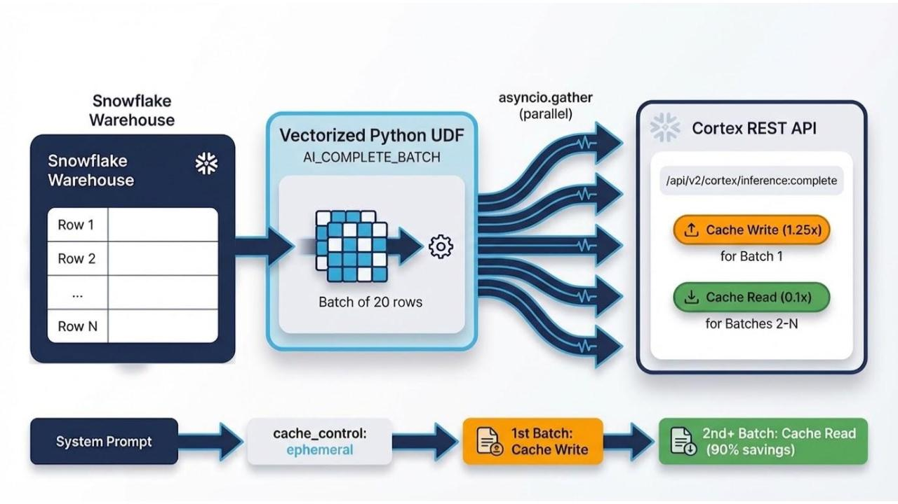

# CORTEXAPICOMPLETE: Cost-Optimized LLM Inference at Scale in Snowflake

*How I built a vectorized UDF that unlocks Prompt Caching, Parallel Execution, and Token Visibility for Cortex LLM calls.*

---

I've learned that the most expensive line of SQL is the one you run 10,000 times without realizing it.

While building my [PII De-identification System for Unstructured Data in Snowflake](https://medium.com/snowflake/building-pii-de-identification-system-for-unstructured-data-in-snowflake-568175e96c7b), I hit a wall. The system uses Claude Sonnet 4.5 to extract sensitive entities from free-form text — names, phone numbers, emails, driver's licenses — with a carefully crafted 1,100+ token system prompt that includes validation rules, few-shot examples, and structured output schemas. It works brilliantly on 10 records. At 10,000 records, the economics break down.

Every row sends the same 1,100-token system prompt. That's 11 million system prompt tokens billed at full price. The actual per-row user text might be 50 tokens. You're paying 20x more for the instructions than the data.

The Cortex REST API offers a feature called **Prompt Caching** that can reduce cached token costs by up to 90%. But getting to it from SQL requires building something that doesn't exist out of the box.

This article walks through `CORTEX_API_COMPLETE` — a generic, reusable vectorized UDF that brings prompt caching, concurrent execution, and full token visibility into a plain SQL interface.

## Introducing CORTEX_API_COMPLETE

`CORTEX_API_COMPLETE` is a [vectorized Python UDF](https://docs.snowflake.com/en/developer-guide/udf/python/udf-python-tabular-vectorized) that calls the Cortex REST API directly, providing prompt caching, concurrent execution, and full token usage visibility — all callable from plain SQL.



### The Interface

```sql
SELECT CORTEX_API_COMPLETE(
    'claude-sonnet-4-5',          -- model
    'Extract entities from text.', -- system prompt (cached for Claude models)
    raw_text,                      -- per-row user prompt
    '{"type": "json", "schema": {...}}'  -- optional: structured output schema
) AS result
FROM my_table;
```

It looks like a regular SQL function call. Snowflake handles the batching automatically — the vectorized UDF receives up to 20 rows per batch, fires concurrent async HTTP requests for all of them, and returns structured results with token usage metadata.

## Prompt Caching and the Cortex REST API

The [Cortex REST API](https://docs.snowflake.com/en/user-guide/snowflake-cortex/cortex-llm-rest-api) exposes the full power of the underlying model providers. The feature that changes the economics most dramatically is **Prompt Caching**.

### How Prompt Caching Works

For Anthropic models (Claude 3.7 Sonnet and later), you mark portions of your message with `cache_control: {"type": "ephemeral"}`. The first request writes to the cache; subsequent requests with the same prefix read from it.

```json
{
    "role": "system",
    "content_list": [
        {
            "type": "text",
            "text": "<your long system prompt>",
            "cache_control": {"type": "ephemeral"}
        }
    ]
}
```

The pricing difference is significant:

- **Cache write**: 1.25x the normal input price (one-time cost)  
- **Cache read**: 0.1x the normal input price (every subsequent request)  
- **Minimum threshold**: 1024+ tokens to activate caching

For a batch of 1,000 records with a shared system prompt: without caching, the full system prompt is billed on every single row. With prompt caching, you pay 1.25x once for the write, then 0.1x for the remaining 999 reads. That's roughly a **90% reduction** on system prompt token costs.

### The Cost Picture

The savings from prompt caching scale with the size of the system prompt and the number of rows processed. For Anthropic models, cache reads cost 0.1x the standard input token rate — a 90% reduction on the cached portion. For OpenAI models, prompt caching is implicit — no request modifications needed. Prompts with 1024+ tokens are automatically cached, and cache reads are discounted relative to the standard input price.

Refer to the [Snowflake Credit Consumption Table](https://www.snowflake.com/legal-files/CreditConsumptionTable.pdf) for current per-model token rates.

### What You Get Back

Each row returns a VARIANT with the full picture:

```json
{
  "success": true,
  "response": "{ extracted entities... }",
  "model": "claude-sonnet-4-5",
  "usage": {
    "prompt_tokens": 51,
    "completion_tokens": 80,
    "cache_write_input_tokens": 1467,
    "total_tokens": 1598
  }
}
```

On error, you get actionable diagnostics — HTTP status, error class, and message — rather than a silent failure:

```json
{
  "success": false,
  "error": "HTTP_429: Rate limit exceeded"
}
```

This makes debugging straightforward: you know whether it was a rate limit, a malformed prompt, a model timeout, or something else entirely.

## How It Works Under the Hood

The UDF is built on three concepts: vectorized batching, async concurrency, and model-aware prompt construction.

### Vectorized Batching

The `@vectorized` decorator tells Snowflake to send rows in batches rather than one at a time:

```py
@vectorized(input=pd.DataFrame, max_batch_size=20)
def complete_batch(df):
    token = get_generic_secret_string('cred')
    client = CortexAsyncClient(token)
    results = asyncio.run(client.process_dataframe(df))
    return pd.Series(results)
```

Each batch invocation receives a DataFrame of up to 20 rows. The UDF processes them all in a single Python execution context, amortizing the setup overhead.

### Async Concurrency

Within each batch, all rows fire concurrently using `aiohttp` and `asyncio.gather`:

```py
async with aiohttp.ClientSession(connector=connector, timeout=timeout) as session:
    tasks = []
    for i, row in df.iterrows():
        payload = self._build_payload(model, base_messages, row, has_fmt_col)
        if payload is None:
            tasks.append(asyncio.sleep(0, result=(i, BatchCompletionResult.empty_result())))
        else:
            tasks.append(self._fetch_cached_completion(session, payload, i, model))

    results = await asyncio.gather(*tasks)
```

20 LLM calls run in parallel rather than sequentially. The wall-clock time for a batch is roughly the time of the slowest single request, not the sum of all 20

### Model-Aware Prompt Construction

The UDF automatically formats the system prompt for prompt caching when using Claude models:

```py
@staticmethod
def _build_system_message(model: str, sys_prompt: str) -> list:
    if not sys_prompt:
        return []

    if "claude" in model.lower():
        return [{
            "role": "system",
            "content_list": [{
                "type": "text",
                "text": sys_prompt,
                "cache_control": {"type": "ephemeral"}
            }]
        }]
    else:
        return [{"role": "system", "content": sys_prompt}]
```

You pass a plain string as the system prompt. The UDF handles the `content_list` / `cache_control` formatting internally. For non-Claude models like OpenAI's GPT series, it uses the standard `content` format — and caching happens implicitly on the API side for prompts above 1024 tokens.

## Prompt Caching in Practice

An important nuance I discovered through testing: prompt caching activates **across batches**, not within the first batch.

Here's why. The vectorized UDF sends all 20 rows in a batch concurrently. Since all requests fire simultaneously, they all independently write to the cache — the cache isn't populated yet when the concurrent requests launch.

The caching benefit kicks in from the **second batch onward**. Snowflake processes a large table in sequential batches of 20 rows. The first batch writes the cache. The second batch — and every subsequent batch — reads from it at 0.1x cost.

For a 1,000-row table:

- **Batch 1** (rows 1–20): All 20 requests write to cache. Cost: 1.25x on the system prompt.  
- **Batches 2–50** (rows 21–1,000): All 980 requests read from cache. Cost: 0.1x on the system prompt.

Net result: 2% of requests pay 1.25x, 98% pay 0.1x. The overall system prompt cost drops to roughly **12% of the uncached price**.

Additionally, Anthropic's ephemeral cache has a 5 minute TTL. If you re-run the same query within that window, *every* request — including the first batch — hits cache reads.

## Capabilities and Limitations

**Capabilities:**


| Capability             | Details                                                                               |
| ---------------------- | ------------------------------------------------------------------------------------- |
| Prompt Caching         | Automatic for Claude (via `cache_control`); implicit for OpenAI (1024+ token prompts) |
| Parallel Execution     | Up to 20 concurrent requests per batch                                                |
| Token Usage Visibility | Full usage dictionary per row — prompt, completion, cache write, cache read tokens    |
| Error Diagnostics      | HTTP status code and error message on every failure                                   |
| Structured Output      | `response_format` parameter for JSON schema enforcement                               |
| Model Support          | All models available through the Cortex REST API                                      |


**Limitations:**

- **Infrastructure setup required.** The UDF needs network rules, a Programmatic Access Token (PAT), and an External Access Integration before it can call the Cortex REST API. This is a one-time setup, but it requires upfront infrastructure work.
- **Ingress rules for network-policy-protected accounts.** Accounts with network policies restricting inbound traffic need additional ingress rules (detailed below).
- **Egress IP maintenance.** Snowflake's egress IP ranges can change. A scheduled task automates this, but it's an operational concern to be aware of.
- **First-batch cache write cost.** The first batch of each query pays the 1.25x cache write cost. The savings materialize from the second batch onward.

## The Setup: Network Rules and Security

This is where things get interesting — and where the infrastructure work lives.

The Cortex REST API is an external HTTPS endpoint (`<account>.snowflakecomputing.com`). Even though a Python UDF running inside Snowflake is calling *back to the same Snowflake account*, it must go through external network egress. This means you need:

```sql
-- 1. Egress rule to allow outbound calls
CREATE NETWORK RULE snowflake_cortex_egress_rule
    MODE = EGRESS
    TYPE = HOST_PORT
    VALUE_LIST = ('<your-account>.snowflakecomputing.com');

-- 2. Programmatic Access Token
ALTER USER <user> ADD PROGRAMMATIC ACCESS TOKEN cortex_ai_function_pat;

-- 3. Secret storage
CREATE SECRET cortex_auth_token
    TYPE = GENERIC_STRING
    SECRET_STRING = '<PAT_TOKEN>';

-- 4. External Access Integration
CREATE EXTERNAL ACCESS INTEGRATION cortex_loopback_integration
    ALLOWED_NETWORK_RULES = (snowflake_cortex_egress_rule)
    ALLOWED_AUTHENTICATION_SECRETS = (cortex_auth_token)
    ENABLED = TRUE;
```

### The Ingress Challenge

Here's a subtlety that caught me off guard. The egress rule alone is often insufficient. Snowflake accounts with [network policies](https://docs.snowflake.com/en/user-guide/network-policies) restricting inbound traffic will block the API request from reaching the endpoint. The request goes out, and gets rejected at the door.

The reason: Snowflake's advanced endpoint protection services apply network policies to all incoming connections, including responses to requests originated by the account's own compute. The UDF's HTTP request arrives from Snowflake's egress IP addresses, which may not be in the account's ingress allowlist.

The fix requires an ingress network rule that allowlists Snowflake account's own [egress IPs](https://docs.snowflake.com/en/user-guide/egress-ip/network-egress#generate-egress-ip-address-ranges):

```sql
CREATE NETWORK RULE snowflake_cortex_ingress_rule
    MODE = INGRESS
    TYPE = IPV4
    VALUE_LIST = ('<snowflake-egress-ips>');
```

### Keeping the Ingress Rule Current

Snowflake's egress IP ranges can change as infrastructure evolves. A stored procedure and weekly task handle this automatically:

```sql
CREATE PROCEDURE UPDATE_CORTEX_INGRESS_RULE()
RETURNS VARCHAR
LANGUAGE SQL
EXECUTE AS CALLER
AS
$$
DECLARE
    ip_list VARCHAR;
    ddl_stmt VARCHAR;
BEGIN
    SELECT LISTAGG('''' || value:"ipv4_prefix"::VARCHAR || '''', ', ')
    INTO :ip_list
    FROM TABLE(FLATTEN(INPUT => PARSE_JSON(SYSTEM$GET_SNOWFLAKE_EGRESS_IP_RANGES())))
    WHERE value:"expires"::TIMESTAMP > CURRENT_TIMESTAMP();

    ddl_stmt := 'CREATE OR REPLACE NETWORK RULE snowflake_cortex_ingress_rule
        MODE = INGRESS TYPE = IPV4 VALUE_LIST = (' || :ip_list || ')';
    EXECUTE IMMEDIATE :ddl_stmt;

    RETURN 'Updated ingress rule with IPs: ' || :ip_list;
END;
$$;

-- Auto-update weekly
CREATE TASK UPDATE_CORTEX_INGRESS_RULE_TASK
    WAREHOUSE = COMPUTE_WH
    SCHEDULE = 'USING CRON 0 2 * * 0 America/Los_Angeles'
AS
    CALL UPDATE_CORTEX_INGRESS_RULE();
```

This setup works reliably once configured, though the need for loopback egress and ingress rules to call your own account's API is an infrastructure pattern worth being aware of.

## Real-World Usage: PII De-identification

The function was born from a real need. In the [PII De-identification System](https://medium.com/snowflake/building-pii-de-identification-system-for-unstructured-data-in-snowflake-568175e96c7b), `CORTEX_API_COMPLETE` powers the entity extraction layer:

```sql
CREATE FUNCTION LLM_EXTRACT_ENTITIES_BATCH(raw_text VARCHAR)
RETURNS VARIANT
AS
$$
SELECT
    CASE
        WHEN result:success = TRUE THEN
            OBJECT_CONSTRUCT('success', TRUE, 'entities', TRY_PARSE_JSON(result:response))
        ELSE
            OBJECT_CONSTRUCT('success', FALSE, 'entities', [], 'error', result:error)
    END
FROM (
    SELECT CORTEX_API_COMPLETE(
        'claude-sonnet-4-5',
        'Extract sensitive entities from the text.
         INFO_TYPES: PERSON_NAME, PHONE_NUMBER, EMAIL_ADDRESS, DRIVERS_LICENSE, CREDIT_CARD_NUMBER.
         Rules: Return exact substrings only. Skip invalid patterns.
         Output JSON array: [{"info_type": "...", "value": "..."}]',
        raw_text,
        '{"type": "json", "schema": {...}}'
    ) AS result
)
$$;
```

The wrapper function presents a clean scalar interface. Snowflake automatically batches calls to `CORTEX_API_COMPLETE` when you use `LLM_EXTRACT_ENTITIES_BATCH` in a `SELECT` over a table:

```sql
SELECT
    id,
    raw_text,
    AI_DEIDENTIFY_TEXT(raw_text) as result
FROM customer_complaints;
```

The analyst doesn't need to know about batching, caching, or async HTTP. They call a function. The cost savings happen transparently.

At Google, I helped build a [similar system for BigQuery using Cloud DLP and Remote Functions](https://github.com/GoogleCloudPlatform/bigquery-dlp-remote-function). The architectural pattern is remarkably similar — a SQL function backed by an external service call with batching and caching. `CORTEX_API_COMPLETE` brings that pattern to Snowflake, replacing the dedicated DLP service with a general-purpose LLM that can adapt to any extraction or transformation task through prompt engineering alone.

## When to Use CORTEXAPICOMPLETE

`CORTEX_API_COMPLETE` is designed for workloads where LLM inference runs at table scale with a shared system prompt. It shines when:

- You're processing thousands of records with a repeated system prompt that benefits from caching  
- Cost optimization on input tokens is a priority  
- You need per-row token usage visibility for cost monitoring and budgeting  
- You need detailed error information for debugging production pipelines  
- You're building reusable AI functions that will be called repeatedly across datasets

For ad-hoc exploration or small one-off queries, the infrastructure setup may not be justified. The value compounds as query volume and system prompt size increase.

## Getting Started

The full implementation is available on GitHub at [Snowflake-Labs/sfguide-customer-issue-deduplication-demo](https://github.com/Snowflake-Labs/sfguide-customer-issue-deduplication-demo). The repo includes:

- `[cortex_api_complete.sql](https://github.com/Snowflake-Labs/sfguide-customer-issue-deduplication-demo/blob/main/cortex_api_complete.sql)` — The generic UDF with network rules, stored procedures, and the convenience task  
- `[ai_deidentify_batch_vectorized.sql](https://github.com/Snowflake-Labs/sfguide-customer-issue-deduplication-demo/blob/main/ai_deidentify_batch_vectorized.sql)` — The PII de-identification wrapper using `CORTEX_API_COMPLETE`

Deploy the SQL files to your Snowflake environment, update the account identifier in the endpoint URL, configure the network rules and PAT, and you have a production-ready, cost-optimized LLM function callable from any SQL query.

The function is generic by design. Swap the model, change the system prompt, adjust the response format — it works for entity extraction, classification, summarization, translation, or any task where you're running the same LLM instruction across thousands of rows. The prompt caching ensures you only pay full price once.

---

*Anant Damle is a Solutions Architect at Snowflake. Previously at Google Cloud, where he built solutions including [BigQuery Data Lineage](https://cloud.google.com/blog/products/data-analytics/architecting-a-data-lineage-system-for-bigquery), [BigQuery DLP Remote Functions](https://github.com/GoogleCloudPlatform/bigquery-dlp-remote-function), and [Trino Autoscaling on Dataproc](https://cloud.google.com/blog/products/databases/autoscaling-for-trino-running-on-a-dataproc-cluster/).*